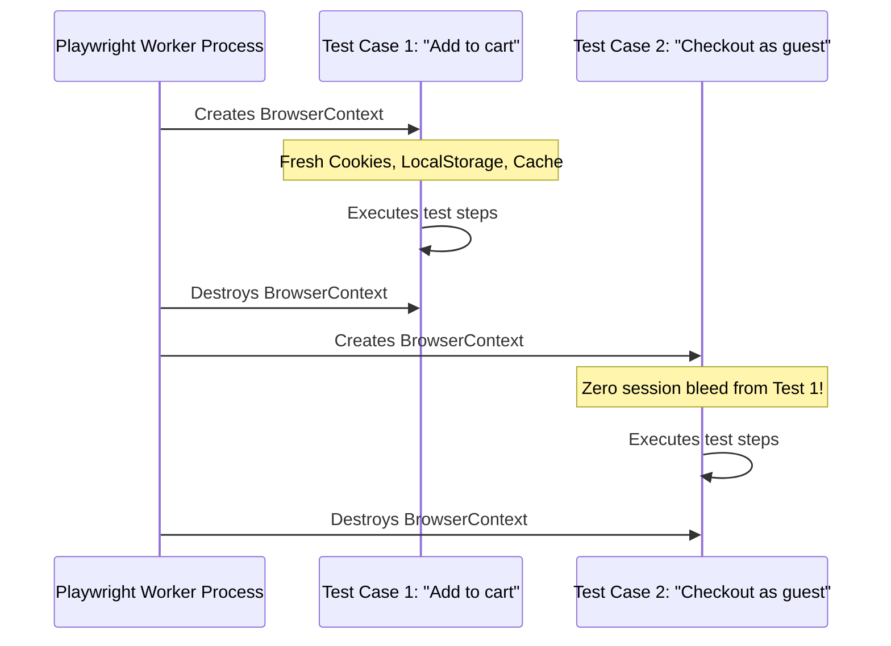

# Playwright Architecture and Test Isolation

## 1. Playwright 3-Tier Architecture

Playwright operates across three distinct architectural layers. This design allows it to deliver superior speed, isolation, and stability compared to legacy WebDriver-based frameworks.

```
┌────────────────────────────────────────────────────────┐
│  Layer 1: Test Code (Client)                           │
│  - Written in TypeScript, JavaScript, Python, C#, Java │
│  - Sends high-level intent commands                    │
└──────────────────────────┬─────────────────────────────┘
                           │
             WebSocket (Persistent, Bidirectional)
                           │
┌──────────────────────────▼─────────────────────────────┐
│  Layer 2: Playwright Server (Command Center)           │
│  - Receives commands from Client                       │
│  - Handles Auto-wait, Retry, Network Interception      │
│  - Manages Tracing, Video, Snapshots, Contexts         │
└──────────────────────────┬─────────────────────────────┘
                           │
             CDP+ Protocol (Direct Browser Control)
                           │
┌──────────────────────────▼─────────────────────────────┐
│  Layer 3: Browser Engines                              │
│  - Chromium (Blink)                                    │
│  - Firefox (Gecko - patched with CDP+ protocol)        │
│  - WebKit (Safari engine - patched with CDP+ protocol) │
└────────────────────────────────────────────────────────┘
```

### Key Architectural Differences

1. **Persistent WebSocket vs HTTP Request-Response:**
   - **Selenium WebDriver:** Sends a separate HTTP REST request for every single interaction (`/session/{id}/element`, `/session/{id}/click`), creating substantial network latency.
   - **Playwright:** Establishes a persistent, bidirectional WebSocket connection between the client runner and the Playwright server. Commands and events stream instantaneously.
2. **Direct CDP+ Protocol Control:**
   - Playwright speaks Chrome DevTools Protocol (CDP) natively to Chromium.
   - The Playwright team actively patches Firefox and WebKit with an equivalent protocol layer. This allows a single, unified API to control all major browser engines without requiring separate third-party drivers (`chromedriver`, `geckodriver`, `safaridriver`).

---

## 2. Browser Object Hierarchy

Playwright organizes browser execution into three distinct tiers:

```
Browser (e.g., Chromium process)
 └── BrowserContext (Isolated incognito profile)
      ├── Page (Tab 1)
      └── Page (Tab 2)
```

| Entity | Description | Lifecycle & Scope |
| :--- | :--- | :--- |
| **`Browser`** | The actual operating system process running the browser engine (e.g. `chrome.exe`). | Started once per worker and shared across multiple tests to eliminate process startup overhead. |
| **`BrowserContext`** | An isolated in-memory user profile, completely equivalent to an Incognito window. | Created fresh for **every single test case** and destroyed immediately after. |
| **`Page`** | A single browser tab or popup window within a `BrowserContext`. | Belongs to a context. A single context can have multiple pages (e.g. opening a new tab). |

---

## 3. Test Isolation Mechanics

Test isolation is the fundamental principle preventing **flaky tests** and **state pollution**.



### Why Test Isolation Matters

- **Zero Session Bleed:** Test 1 logging in as Admin will never bleed cookies or localStorage into Test 2 running as a Guest.
- **Deterministic Parallel Execution:** Because contexts share zero state, tests can run concurrently on multiple worker threads in any arbitrary order without collisions.
- **High Performance:** Launching a full `Browser` process takes ~1000ms, but creating a new `BrowserContext` takes **< 10ms**. Playwright reuses the running browser process while providing brand-new contexts for every test.

---

## 4. Headless vs Headed Modes

Playwright supports two browser execution modes:

```bash
# Headless mode (Default in CI, runs in background without UI window)
npx playwright test

# Headed mode (Displays live browser windows during execution)
npx playwright test --headed
```

| Aspect | Headless Mode | Headed Mode |
| :--- | :--- | :--- |
| **Window Visibility** | Background process without UI display | Opens visible OS window for each browser |
| **Speed & Resource Usage** | Fastest, lowest CPU and RAM consumption | Slower due to rendering and display pipeline |
| **Primary Use Case** | Continuous Integration (CI/CD), headless servers | Local development, visual debugging, tutorials |
| **Visual Inspection** | Relies on Screenshots, Videos, and Trace Viewer | Live visual feedback during execution |
