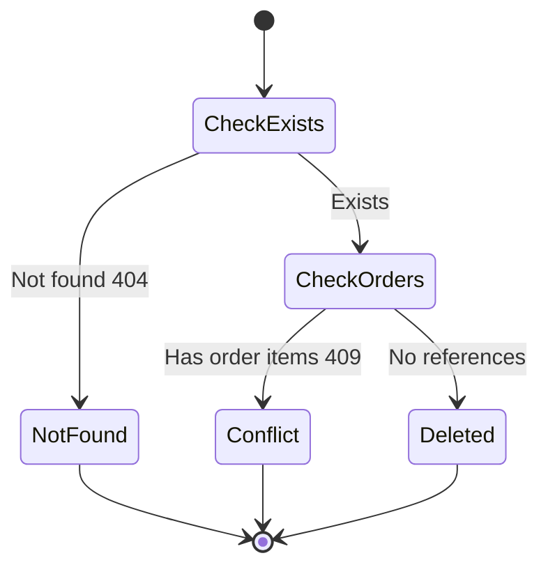

# Test Cases — Admin Product CRUD (EP + BVA + STT)

Sources: `src/lib/admin/product-schema.ts:7-41`, `src/lib/admin/product-admin-service.ts:31-72`

## Input Analysis

- C1 Name — text required 1–255 → EP
- C2 Description — optional, max 2000 → EP
- C3 Price — number >0 ถึง 10,000,000 (สมมติ integer baht step=1) → BVA
- C4 CategoryId — int บวก required → EP
- C5 Delete guard — exists → order_items? → 404/409/delete → STT

## C1 Name

| ID | Name | Description | Input: Name | Expected Output |
|---|---|---|---|---|
| TC-01 | Valid normal name | ชื่อสินค้าปกติ ระบบต้องรับ | iPhone 16 Pro | Valid - accepted |
| TC-02 | Minimum 1 char | ชื่อสั้นสุด ระบบต้องรับ | ก | Valid - accepted |
| TC-03 | Maximum 255 chars | ชื่อยาวครบพอดี ระบบต้องรับ | ก x255 | Valid - accepted |
| TC-04 | Empty name | ไม่กรอกชื่อ ระบบต้องปฏิเสธ |  | Invalid - rejected |
| TC-05 | Over 255 chars | ยาวเกิน 1 ตัว ระบบต้องปฏิเสธ | ก x256 | Invalid - rejected |

| ID | Name | Description | Input: Name | Expected Output |
|---|---|---|---|---|
| BT-01 | Real product name | ชื่อสินค้าจริงในร้าน | MacBook Air M3 | Valid - accepted |
| BT-02 | Thai product name | ชื่อสินค้าภาษาไทย | แอร์พอด โปร 2 | Valid - accepted |
| BT-03 | Blank spaces only | กรอกแต่ช่องว่าง (trim แล้วว่าง) ระบบต้องปฏิเสธ | `   ` | Invalid - rejected |

## C2 Description

| ID | Name | Description | Input: Description | Expected Output |
|---|---|---|---|---|
| TC-06 | Empty allowed | เว้นว่างได้ ระบบต้องรับ |  | Valid - accepted |
| TC-07 | Normal description | รายละเอียดปกติ ระบบต้องรับ | ชิป M3 แรม 8GB | Valid - accepted |
| TC-08 | Maximum 2000 chars | ยาวครบพอดี ระบบต้องรับ | ก x2000 | Valid - accepted |
| TC-09 | Over 2000 chars | ยาวเกิน ระบบต้องปฏิเสธ | ก x2001 | Invalid - rejected |

| ID | Name | Description | Input: Description | Expected Output |
|---|---|---|---|---|
| BT-04 | No description | ร้านรีบลงสินค้าไม่ใส่รายละเอียด |  | Valid - accepted |
| BT-05 | Long spec paste | คัดลอกสเปกยาวๆ มาวาง | สเปก... (1800 ตัวอักษร) | Valid - accepted |

## C3 Price (BVA 1–10,000,000)

| ID | Name | Description | Input: Price | Expected Output |
|---|---|---|---|---|
| TC-10 | Zero price | ราคา 0 (positive เท่านั้น) ระบบต้องปฏิเสธ | 0 | Invalid - rejected |
| TC-11 | Minimum 1 baht | ราคาต่ำสุด ระบบต้องรับ | 1 | Valid - accepted |
| TC-12 | Just above min | 2 บาท ระบบต้องรับ | 2 | Valid - accepted |
| TC-13 | Below max | 9,999,999 ระบบต้องรับ | 9999999 | Valid - accepted |
| TC-14 | Maximum 10M | ราคาสูงสุดพอดี ระบบต้องรับ | 10000000 | Valid - accepted |
| TC-15 | Over maximum | เกินไป 1 บาท ระบบต้องปฏิเสธ | 10000001 | Invalid - rejected |
| TC-16 | Negative price | ราคาติดลบ ระบบต้องปฏิเสธ | -100 | Invalid - rejected |
| TC-17 | Comma input converts | กรอก "1,000" parseNumberInput ต้องแปลงเป็น 1000 แล้วรับ | 1,000 (raw string) | Valid - accepted (parsed 1000) |
| TC-18 | Non-numeric input | กรอก "abc" แปลงไม่ได้ ระบบต้องปฏิเสธ | abc (raw string) | Invalid - rejected |
| TC-19 | Empty price input | เว้นว่าง แปลงเป็น null ระบบต้องปฏิเสธ |  (raw string) | Invalid - rejected |

| ID | Name | Description | Input: Price | Expected Output |
|---|---|---|---|---|
| BT-06 | Real cheap accessory | เคสถูกสุดในร้าน | 199 | Valid - accepted |
| BT-07 | Real laptop price | โน้ตบุ๊กราคากลาง | 42900 | Valid - accepted |
| BT-08 | Typo negative | พิมพ์ติดลบโดยไม่ตั้งใจ | -500 | Invalid - rejected |
| BT-09 | Paste with spaces | คัดลอกราคามีช่องว่าง | ` 4,290 ` (raw) | Valid - accepted (parsed 4290) |

## C4 CategoryId

| ID | Name | Description | Input: CategoryId | Expected Output |
|---|---|---|---|---|
| TC-20 | Valid category | เลือกหมวดหมู่จริง ระบบต้องรับ | 1 | Valid - accepted |
| TC-21 | Zero not selected | ไม่เลือก (0) ระบบต้องปฏิเสธ | 0 | Invalid - rejected |
| TC-22 | Negative category | id ติดลบ ระบบต้องปฏิเสธ | -1 | Invalid - rejected |
| TC-23 | Non-integer | ทศนิยม ระบบต้องปฏิเสธ | 1.5 | Invalid - rejected |
| TC-24 | Missing category | ไม่ส่งมา (null) ระบบต้องปฏิเสธ | null | Invalid - rejected |

| ID | Name | Description | Input: CategoryId | Expected Output |
|---|---|---|---|---|
| BT-10 | Phone category | เลือกหมวดมือถือ | 2 | Valid - accepted |
| BT-11 | Forgot to select | ลืมเลือกหมวดหมู่ | 0 | Invalid - rejected |

## C5 Delete Guard — STT

| ID | Name | Description | Input: Current State | Input: ProductId | Input: OrderItems | Expected: Next State | Expected Output |
|---|---|---|---|---|---|---|---|
| ST-01 | Delete success | สินค้ามีอยู่ ไม่ถูกอ้างถึง ลบสำเร็จ | CheckOrders | 10 | 0 | Deleted | Valid - state changed to Deleted |
| ST-02 | Delete missing product | สินค้าไม่มีอยู่ ตอบ 404 | CheckExists | 9999 | - | NotFound | Valid - state changed to NotFound (404) |
| ST-03 | Delete blocked by orders | สินค้าถูกใช้ในออเดอร์ ตอบ 409 | CheckOrders | 5 | 3 | Conflict | Valid - state changed to Conflict (409) |
| ST-04 | Invalid: skip guard | ลบโดยไม่เช็ค order_items ต้องถูกบล็อก | CheckExists | 5 | skipped | - | Invalid - transition not allowed |

| ID | Journey Name | Business Story | State Path | Input Conditions | Expected Final State |
|---|---|---|---|---|---|
| SJ-01 | Add then delete unused product | แอดมินเพิ่มสินค้าใหม่ด้วยข้อมูลถูกต้อง จากนั้นลบสินค้าที่ยังไม่มีออเดอร์อ้าง ระบบลบสำเร็จ | Create valid --> CheckExists --> CheckOrders --> Deleted | C1 valid, C3 42900, C4 valid, orderItems 0 | Deleted — สินค้าหายจากระบบ |
| SJ-02 | Try to delete bestseller | แอดมินพยายามลบสินค้าขายดีที่มีออเดอร์อ้างอยู่ ระบบบล็อกด้วย 409 | CheckExists --> CheckOrders --> Conflict | productId 5, orderItems 3 | Conflict — สินค้ายังอยู่ |
| SJ-03 | Delete typo id | แอดมินพิมพ์ id ผิด ระบบตอบ 404 | CheckExists --> NotFound | productId 9999 | NotFound — แจ้งไม่พบสินค้า |
| SJ-04 | Create fails then fixed | แอดมินกรอกราคา 0 ครั้งแรกโดนตีกลับ จากนั้นแก้เป็น 199 แล้วบันทึกสำเร็จ | Create invalid --> Create valid --> Saved | C3 0 then 1+ | Saved — บันทึกสำเร็จหลังแก้ |
