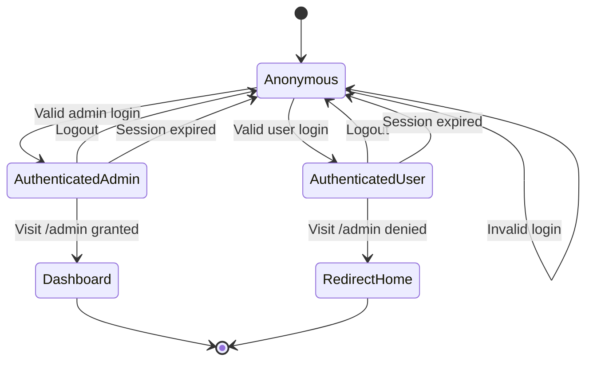

# Test Cases — Auth & Admin Access Control (EP + STT)

Sources: `src/lib/auth-schema.ts:12-45`, `src/lib/admin/admin-guard.ts:11-13`, `src/lib/admin/require-admin.ts:11-17`

## Input Analysis

- C1 Email — text, required, email format → EP
- C2 Password — text, required, min 8 → EP (length partitions)
- C3 Name — text, required, 2-50 → EP
- C4 ConfirmPassword — ต้องตรงกับ Password → EP
- C5 Role — admin vs อื่นๆ → EP
- C6 Access flow — Anonymous / Authenticated-User / Authenticated-Admin → STT

Combination: State Transition Testing

## C1 Email — Equivalence Partitions

```
Email — Equivalence Partitions

  [VALID]
  [normal email] [email with dot+tag]

  [INVALID]
  [empty] [no @] [no domain] [leading space]
```

### Unit Test Cases

| ID | Name | Description | Input: Email | Expected Output |
|---|---|---|---|---|
| TC-01 | Valid standard email | อีเมลรูปแบบปกติ ระบบต้องรับ | somchai@gmail.com | Valid - accepted |
| TC-02 | Valid dot tag email | อีเมลมีจุดและ alias ระบบต้องรับ | som.chai+shop@gmail.com | Valid - accepted |
| TC-03 | Empty email | ไม่กรอกอีเมล ระบบต้องปฏิเสธ |  | Invalid - rejected |
| TC-04 | Missing at-sign | ไม่มี @ ระบบต้องปฏิเสธ | somchaigmail.com | Invalid - rejected |
| TC-05 | Missing domain | ไม่มีโดเมนหลัง @ ระบบต้องปฏิเสธ | somchai@ | Invalid - rejected |
| TC-06 | Leading space | มีช่องว่างหน้า (loginSchema ไม่ trim) ระบบต้องปฏิเสธ | ` somchai@gmail.com` | Invalid - rejected |

### Business Test Cases (for acceptance/integration testing)

| ID | Name | Description | Input: Email | Expected Output |
|---|---|---|---|---|
| BT-01 | Typical Thai user | ผู้ใช้ไทยสมัครด้วย Gmail ทั่วไป | nok.suda@gmail.com | Valid - accepted |
| BT-02 | Company email | พนักงานใช้อีเมลบริษัท | admin@codingthailand.com | Valid - accepted |
| BT-03 | Typo missing dot | ผู้ใช้พิมพ์อีเมลตกหล่น เป็นความผิดพลาดที่พบบ่อย | user@gmailcom | Invalid - rejected |
| BT-04 | Thai quickly submit empty | กดสมัครโดยลืมกรอกอีเมล |  | Invalid - rejected |

## C2 Password — Equivalence Partitions

```
Password (min 8) — Equivalence Partitions

  [VALID]
  [8 chars] [longer than 8]

  [INVALID]
  [empty] [1-7 chars]
```

### Unit Test Cases

| ID | Name | Description | Input: Password | Expected Output |
|---|---|---|---|---|
| TC-07 | Exactly 8 chars | รหัสผ่านยาวครบขั้นต่ำพอดี ระบบต้องรับ | 12345678 | Valid - accepted |
| TC-08 | Longer than minimum | รหัสผ่านยาวเกินขั้นต่ำ ระบบต้องรับ | Password123 | Valid - accepted |
| TC-09 | Empty password | ไม่กรอกรหัสผ่าน ระบบต้องปฏิเสธ |  | Invalid - rejected |
| TC-10 | Too short 7 chars | สั้นกว่าขั้นต่ำ 1 ตัว ระบบต้องปฏิเสธ | 1234567 | Invalid - rejected |
| TC-11 | Too short 1 char | รหัสผ่านสั้นมาก ระบบต้องปฏิเสธ | a | Invalid - rejected |

### Business Test Cases (for acceptance/integration testing)

| ID | Name | Description | Input: Password | Expected Output |
|---|---|---|---|---|
| BT-05 | Typical strong password | ผู้ใช้ตั้งรหัสผ่านทั่วไปที่จำง่ายและผ่านเกณฑ์ | Suda1234 | Valid - accepted |
| BT-06 | User uses phone number | ผู้ใช้เอาตัวเลข 10 หลักมาตั้ง ผ่านความยาวแต่ควรเตือนความเสี่ยง (เคสนี้ระบบรับ) | 0812345678 | Valid - accepted |
| BT-07 | Short birthday password | ผู้ใช้ตั้งวันเกิด 6 หลัก สั้นไป ระบบต้องปฏิเสธ | 120568 | Invalid - rejected |

## C3 Name — Equivalence Partitions

```
Name (2-50) — Equivalence Partitions

  [VALID]
  [2 chars] [normal name] [50 chars]

  [INVALID]
  [empty] [1 char] [51+ chars]
```

### Unit Test Cases

| ID | Name | Description | Input: Name | Expected Output |
|---|---|---|---|---|
| TC-12 | Minimum 2 chars | ชื่อสั้นสุดที่อนุญาต ระบบต้องรับ | สม | Valid - accepted |
| TC-13 | Normal Thai name | ชื่อไทยทั่วไป ระบบต้องรับ | สมชาย ใจดี | Valid - accepted |
| TC-14 | Maximum 50 chars | ชื่อยาวครบ 50 ตัวพอดี ระบบต้องรับ | ก repeated 50 chars | Valid - accepted |
| TC-15 | Empty name | ไม่กรอกชื่อ ระบบต้องปฏิเสธ |  | Invalid - rejected |
| TC-16 | Single char | ชื่อ 1 ตัว สั้นไป ระบบต้องปฏิเสธ | ก | Invalid - rejected |
| TC-17 | Over maximum 51 chars | ชื่อยาวเกิน 1 ตัว ระบบต้องปฏิเสธ | ก repeated 51 chars | Invalid - rejected |

### Business Test Cases (for acceptance/integration testing)

| ID | Name | Description | Input: Name | Expected Output |
|---|---|---|---|---|
| BT-08 | Typical signup name | ผู้ใช้สมัครด้วยชื่อเล่นจริง | นก | Valid - accepted |
| BT-09 | Full name with surname | ผู้ใช้กรอกชื่อ-นามสกุลเต็ม | สุดา แก้วใส | Valid - accepted |
| BT-10 | Single initial typo | ผู้ใช้กดมาแค่ตัวเดียวแล้วกดสมัคร | S | Invalid - rejected |

## C4 ConfirmPassword — Equivalence Partitions

```
ConfirmPassword — Equivalence Partitions

  [VALID]
  [matches password]

  [INVALID]
  [empty] [mismatch] [case differs]
```

### Unit Test Cases

| ID | Name | Description | Input: Password | Input: ConfirmPassword | Expected Output |
|---|---|---|---|---|---|
| TC-18 | Passwords match | ยืนยันตรงกัน ระบบต้องรับ | Password123 | Password123 | Valid - accepted |
| TC-19 | Empty confirm | ไม่กรอกช่องยืนยัน ระบบต้องปฏิเสธ | Password123 |  | Invalid - rejected |
| TC-20 | Mismatch last char | ต่างกันตัวเดียว ระบบต้องปฏิเสธ | Password123 | Password124 | Invalid - rejected |
| TC-21 | Case differs | ตัวพิมพ์เล็กใหญ่ต่างกัน ระบบต้องปฏิเสธ | Password123 | password123 | Invalid - rejected |

### Business Test Cases (for acceptance/integration testing)

| ID | Name | Description | Input: Password | Input: ConfirmPassword | Expected Output |
|---|---|---|---|---|---|
| BT-11 | Careful user retypes | ผู้ใช้พิมพ์ซ้ำถูกต้อง | Suda2026 | Suda2026 | Valid - accepted |
| BT-12 | Typo on confirm | ผู้ใช้รีบพิมพ์ช่องยืนยันผิด เป็นเคสพบบ่อย | Suda2026 | Suda2025 | Invalid - rejected |

## C5 Role (isAdmin) — Equivalence Partitions

```
Role — Equivalence Partitions

  [VALID ADMIN]
  [admin]

  [INVALID / NON-ADMIN]
  [user] [null] [undefined] [ADMIN uppercase] [empty]
```

### Unit Test Cases

| ID | Name | Description | Input: Role | Expected Output |
|---|---|---|---|---|
| TC-22 | Admin role | role admin ตรงเงื่อนไขพอดี ได้สิทธิ์ | admin | Valid - accepted (isAdmin true) |
| TC-23 | Normal user | role user ไม่ใช่แอดมิน ถูกปฏิเสธ | user | Invalid - rejected (isAdmin false) |
| TC-24 | Null role | role null ถูกปฏิเสธ | null | Invalid - rejected (isAdmin false) |
| TC-25 | Missing role | ไม่มี field role ถูกปฏิเสธ | undefined | Invalid - rejected (isAdmin false) |
| TC-26 | Uppercase ADMIN | ตัวพิมพ์ใหญ่ไม่ตรงแบบ case-sensitive ถูกปฏิเสธ | ADMIN | Invalid - rejected (isAdmin false) |
| TC-27 | Empty role | role ว่าง ถูกปฏิเสธ |  | Invalid - rejected (isAdmin false) |

### Business Test Cases (for acceptance/integration testing)

| ID | Name | Description | Input: Role | Expected Output |
|---|---|---|---|---|
| BT-13 | Store owner admin | เจ้าของร้านที่ตั้ง role ใน DB เป็น admin | admin | Valid - accepted |
| BT-14 | New signup defaults user | ผู้สมัครใหม่ได้ role user อัตโนมัติ (input false) | user | Invalid - rejected (เข้า admin ไม่ได้) |
| BT-15 | Tampered role string | มีคนพยายามส่ง role แปลกๆ มา | superadmin | Invalid - rejected |

## C6 Access Flow — State Transition Testing

States: Anonymous, Authenticated-User, Authenticated-Admin

```
Auth Access

  [Start] --> [Anonymous] --valid user login--> [Authenticated-User] --visit /admin--> [Redirect /] --> [End]
                |                                   |
                |--valid admin login--> [Authenticated-Admin] --visit /admin--> [Dashboard] --> [End]
                |
                |--invalid login--> [Anonymous] (stay, show error)
                |
             [Any authenticated] --logout--> [Anonymous]
             [Authenticated-*] --session expired--> [Anonymous]
```



### Transition Table (Pivot Matrix)

| From \ To | Anonymous | Authenticated-User | Authenticated-Admin | Dashboard | Redirect-Login | Redirect-Home |
|---|---|---|---|---|---|---|
| Anonymous | Invalid login (stay) | Valid user login | Valid admin login | - | Direct /admin without login | - |
| Authenticated-User | Logout / Session expired | - | - | - | - | Visit /admin denied |
| Authenticated-Admin | Logout / Session expired | - | - | Visit /admin granted | - | - |

### Level 1 — Transition Test Cases

| ID | Name | Description | Input: Current State | Input: Email | Input: Password | Input: Role | Expected: Next State | Expected Output |
|---|---|---|---|---|---|---|---|---|
| ST-01 | User login success | ผู้ใช้กรอกถูก เข้าสู่สถานะ user | Anonymous | nok.suda@gmail.com | Suda1234 | user | Authenticated-User | Valid - state changed to Authenticated-User |
| ST-02 | Admin login success | แอดมินกรอกถูก เข้าสู่สถานะ admin | Anonymous | admin@codingthailand.com | Admin1234 | admin | Authenticated-Admin | Valid - state changed to Authenticated-Admin |
| ST-03 | Login fails wrong password | รหัสผ่านสั้น/ผิด อยู่หน้าเดิมพร้อม error | Anonymous | nok.suda@gmail.com | 123 | user | Anonymous | Invalid - transition not allowed, show validation error |
| ST-04 | User denied admin page | user เปิด /admin ถูกดีดกลับหน้าร้าน | Authenticated-User | - | - | user | Redirect-Home | Valid - state changed to Redirect-Home |
| ST-05 | Admin enters dashboard | admin เปิด /admin เข้าได้ | Authenticated-Admin | - | - | admin | Dashboard | Valid - state changed to Dashboard |
| ST-06 | Logout returns anonymous | กด logout กลับเป็นนิรนาม | Authenticated-User | - | - | - | Anonymous | Valid - state changed to Anonymous |
| ST-07 | Session expired | session หมดอายุ กลับเป็นนิรนาม | Authenticated-User | - | - | - | Anonymous | Valid - state changed to Anonymous |
| ST-08 | Invalid: user jumps to dashboard | user พยายามข้ามไป dashboard ตรงๆ ต้องถูกบล็อก | Authenticated-User | - | - | user | - | Invalid - transition not allowed |
| ST-09 | Invalid: anonymous opens dashboard | คนไม่ login เปิด /admin ต้องไปหน้า login | Anonymous | - | - | - | Redirect-Login | Valid - state changed to Redirect-Login (blocked) |

### Level 2 — State Journey Scenarios (state transition — for acceptance/integration testing)

| ID | Journey Name | Business Story | State Path | Input Conditions | Expected Final State |
|---|---|---|---|---|---|
| SJ-01 | New user signs up and shops normally | ผู้ใช้ใหม่สมัครด้วยชื่อ อีเมล และรหัสผ่านที่ถูกต้อง ระบบสร้างบัญชี role user จากนั้น login เข้าสู่สถานะ user และเข้าชมหน้าร้านได้ปกติ เมื่อลองเปิดหน้า admin ระบบ redirect กลับหน้าร้าน | Anonymous --[signup+login]--> Authenticated-User --[visit /admin]--> Redirect-Home | C1 valid email, C2 8+ chars, C3 2-50 chars, C4 match, C5 user | Redirect-Home — user ใช้งานได้แต่เข้า admin ไม่ได้ |
| SJ-02 | Admin manages store | แอดมิน login ด้วยบัญชี admin ระบบพาเข้าสู่สถานะ admin เมื่อเปิดหน้า /admin ระบบอนุญาตให้เข้าดู dashboard และจัดการสินค้าได้ | Anonymous --[admin login]--> Authenticated-Admin --[visit /admin]--> Dashboard | C1 admin email, C2 valid, C5 admin | Dashboard — บริหารร้านได้ |
| SJ-03 | Anonymous attacker blocked | คนไม่ login พิมพ์ URL /admin ตรงๆ ระบบตรวจว่าไม่มี session จึง redirect ไปหน้า login ไม่เปิดเผยว่ามีหน้านี้อยู่ | Anonymous --[direct /admin]--> Redirect-Login | No session | Redirect-Login — ถูกบล็อก |
| SJ-04 | User mistypes password then succeeds | ผู้ใช้กรอกรหัสผ่านสั้นไปครั้งแรก ระบบแสดง error และค้างที่หน้าเดิม จากนั้นแก้เป็นรหัสผ่านที่ถูกต้องแล้ว login สำเร็จ | Anonymous --[invalid]--> Anonymous --[valid]--> Authenticated-User | C2 7 chars then 8+ chars | Authenticated-User — เข้าใช้งานได้หลังแก้ |
| SJ-05 | Session expires mid-use | ผู้ใช้ login ค้างไว้จน session หมดอายุ ครั้งถัดไปที่เปิดหน้า admin ระบบพากลับไป login ใหม่ | Authenticated-User --[expired]--> Anonymous --[visit /admin]--> Redirect-Login | Session expiresAt passed | Redirect-Login — ต้อง login ใหม่ |
