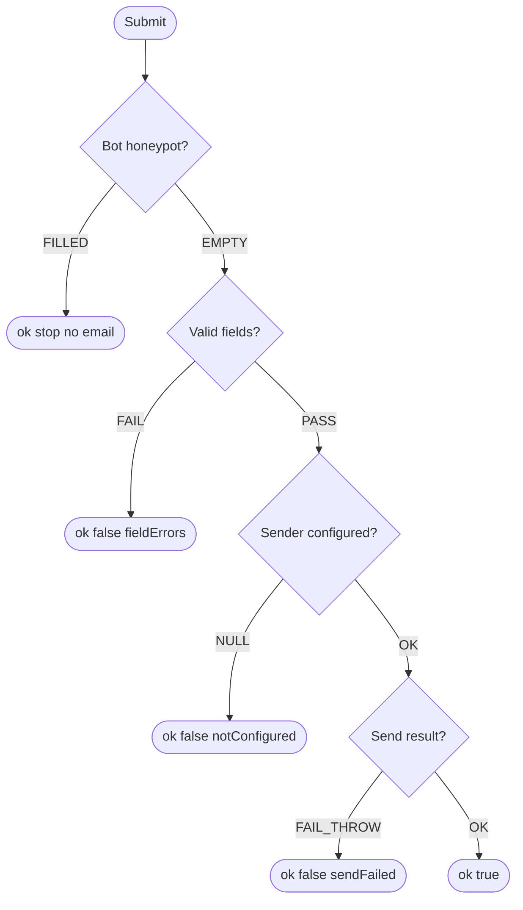

# Test Cases — Contact Us (EP + Sequential)

Sources: `src/lib/contact-schema.ts:3-24`, `src/lib/contact/contact-service.ts:34-65`, `src/lib/contact/honeypot.ts:8-10`

## Input Analysis (Sequential: honeypot → validate → sender)

- C1 Name 2–100 → EP | C2 Email format → EP | C3 Subject 3–150 → EP | C4 Message 10–2000 → EP
- C5 Honeypot website → EP | C6 Sender (null/fail/throw/ok) → EP

| ID | Name | Description | Input: Field | Expected Output |
|---|---|---|---|---|
| TC-01 | Name min 2 | ชื่อสั้นสุดรับ | สม | Valid - accepted |
| TC-02 | Name 1 char reject | 1 ตัวไม่รับ | ก | Invalid - rejected |
| TC-03 | Name 100 ok | 100 ตัวรับ | ก x100 | Valid - accepted |
| TC-04 | Name 101 reject | 101 ตัวไม่รับ | ก x101 | Invalid - rejected |
| TC-05 | Subject min 3 | หัวข้อ 3 ตัวรับ | สอบถาม | Valid - accepted |
| TC-06 | Subject 2 reject | 2 ตัวไม่รับ | ถาม | Invalid - rejected |
| TC-07 | Subject 150 ok / 151 reject | ขอบบนหัวข้อ | ก x150 / ก x151 | Valid / Invalid |
| TC-08 | Message min 10 | 10 ตัวรับ | สนใจคอร์สครับผม | Valid - accepted |
| TC-09 | Message 9 reject | 9 ตัวไม่รับ | สนใจครับ | Invalid - rejected |
| TC-10 | Message 2000 ok / 2001 reject | ขอบบนข้อความ | ก x2000 / ก x2001 | Valid / Invalid |
| TC-11 | Bad email reject | อีเมลผิด format | user-at-mail | Invalid - rejected |
| TC-12 | Human honeypot empty | คนจริงเว้นว่าง/undefined ผ่าน |  / undefined | Valid - accepted (not bot) |
| TC-13 | Bot fills honeypot | บอทกรอก ตอบ ok แต่ไม่ส่ง | http://spam.com | Valid - accepted (silent drop, no email) |
| TC-14 | Bot spaces only | ช่องว่างอย่างเดียวถือว่าคน | `   ` | Valid - accepted (not bot) |

| ID | Name | Description | Input: Sender | Expected Output |
|---|---|---|---|---|
| TC-15 | Sender not configured | env ไม่ครบ ตอบ notConfigured | null sender | Invalid - rejected (notConfigured) |
| TC-16 | Send fails status | Resend ตอบ !ok ตอบ sendFailed | {ok:false,status:500} | Invalid - rejected (sendFailed) |
| TC-17 | Send throws | fetch throw ตอบ sendFailed | throw | Invalid - rejected (sendFailed) |
| TC-18 | Send success | ส่งสำเร็จ | {ok:true} | Valid - accepted |

| ID | Name | Description | Input: Scenario | Expected Output |
|---|---|---|---|---|
| BT-01 | Real inquiry | ลูกค้าถามคอร์สจริง | สมชาย/user@gmail.com/สอบถามคอร์ส/ข้อความ 50 ตัว | Valid - accepted |
| BT-02 | Too short message | พิมพ์มาแค่ "สนใจครับ" | message 9 ตัว | Invalid - rejected |
| BT-03 | Spam bot | บอทกรอก website | website filled | Valid - accepted (drop) |
| BT-04 | Email down | Resend ล่มตอนส่ง | sender fail | Invalid - rejected (sendFailed) |

| ID | Scenario Name | Business Scenario | Honeypot | Fields | Sender | Covers | Expected Output |
|---|---|---|---|---|---|---|---|
| TS-01 | Legit message delivered | ลูกค้ากรอกครบถ้วน honeypot ว่าง validation ผ่าน sender พร้อม อีเมลถูกส่ง | empty | all valid | ok | C5-BT + C1..C4-BT + C6-BT | Message sent — ok true |
| TS-02 | Bot silently dropped | บอทกรอกช่องซ่อน ระบบตอบ ok ทันทีโดยไม่ validate และไม่ส่งอีเมล | filled | anything | - | C5-BT | Dropped — ok true, no email |
| TS-03 | Validation stops before send | ผู้ใช้ลืมกรอก message ระบบตีกลับ fieldErrors โดยไม่เรียก sender | empty | message 9 chars | not called | C4-BT | Rejected — fieldErrors, sender not called |
| TS-04 | Unconfigured backend | ฟอร์มถูกแต่ env ขาด ระบบตอบ notConfigured | empty | all valid | null | C6-BT | Rejected — notConfigured |
| TS-05 | Resend fails at night | ฟอร์มถูก sender พร้อมแต่ Resend 500 ระบบตอบ sendFailed | empty | all valid | fail | C6-BT | Rejected — sendFailed |
